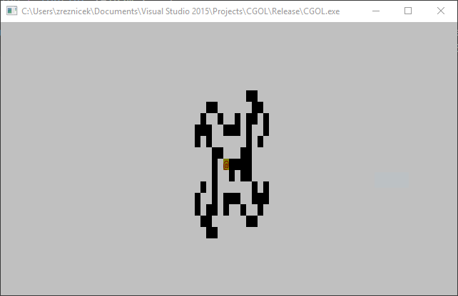

# Langton's Ant

As per the Wikipedia reference:

> Langton's ant is a two-dimensional [universal Turing machine](https://en.wikipedia.org/wiki/Universal_Turing_machine) with a very simple set of rules but complex [emergent](https://en.wikipedia.org/wiki/Emergence) behavior. It was invented by [Chris Langton](https://en.wikipedia.org/wiki/Chris_Langton) in 1986 and runs on a [square lattice](https://en.wikipedia.org/wiki/Square_tiling) of black and white cells. The [universality](https://en.wikipedia.org/wiki/Computationally_universal) of Langton's ant was proven in 2000. The idea has been generalized in several different ways, such as [turmites](https://en.wikipedia.org/wiki/Turmite) which add more colors and more states.

#### Code Golfed in 447 bytes\*

###### *\* including the #include statements*

### Usage

Run the executable in /langtons-ant/dist/. Hold a key. Backspace stops the program so don't hold that one.

###### *The program will eventually crash when the ant tries to walk to the top of the screen. I know this. I don't care.*