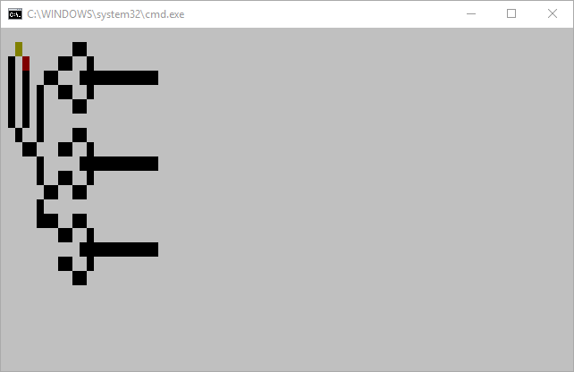

# WireWorld

As per the Wikipedia reference:

> Wireworld is a [cellular automaton](https://en.wikipedia.org/wiki/Cellular_automaton) first proposed by [Brian Silverman](https://en.wikipedia.org/wiki/Brian_Silverman) in 1987, as part of his program Phantom Fish Tank. It subsequently became more widely known as a result of an article in the "Computer Recreations" column of [Scientific American](https://en.wikipedia.org/wiki/Scientific_American). Wireworld is particularly suited to simulating electronic logic elements, or "gates", and, despite the simplicity of the rules, Wireworld is [Turing-complete](https://en.wikipedia.org/wiki/Turing-complete).

#### Code Golfed in 799 bytes\*

###### *\* including the #include statements*

### Usage

[PDCurses](https://www.projectpluto.com/win32a.htm) is used to compile the program on Windows, and thus if compiled on -nix machines the color definitions will be wrong and therefore different. I considered using #defines to make the colors cross-platform, but that would've added 150ish bytes that I deemed unnecessary.

Downloading or cloning the repo will give you the **wireworld.exe** file in /wireworld/dist/. If you double-click the executable all you will see is a white screen, and nothing will happen. Included is the pdcurses.dll file which is needed to run the executable, as well as some batch files to see some basic implementations of Wireworld. Double-clicking the batch files will open up Wireworld with some preconfigured values. Using the command line, you are also able to create your own Wireworld implementations. The argument syntax is as follows:

`.\wireworld.exe <wires> - <electron heads> - <electron tails>`

Note the dashes between the different types of cells. Any key press updates the state of the world 1 tick, while **backspace** stop execution.

### Brief Overview

* Code-golfed Wireworld implementation in C
* Input arguments generate the world
* Error checks the input arguments to make sure they are within the grid
* World tick on key press
* Backspace exits the program
* *can hopefully compile on -nix machines. untested at this point*